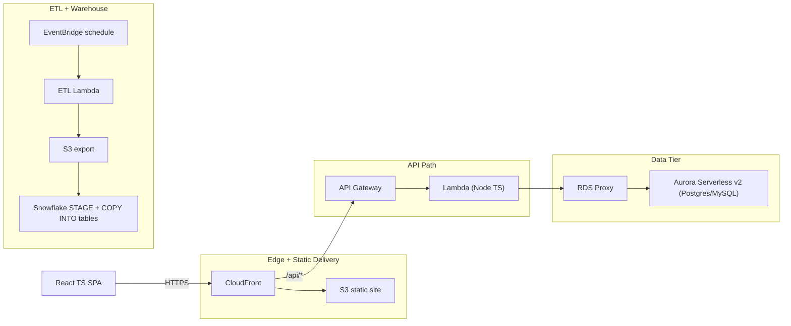
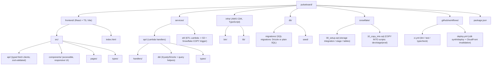

# Pulse Board

## Serverless Orders & Subscriptions Analytics

A small SaaS-ish app where users can browse orders/subscriptions and see analytics (MRR, churn, cohort retention).

- Frontend (React + TypeScript) served via CloudFront + S3
- Serverless API on API Gateway + AWS Lambda (Node.js/TypeScript)
- Relational DB on Aurora RDS (Serverless v2) with strong SQL (joins, window functions)
- Data export → Snowflake (for analytics) via an ETL Lambda and a COPY INTO workflow
- CI/CD via GitHub Actions (build, test, deploy, preview envs)
- IaC with AWS CDK (TypeScript) to provision everything

## Architecture

### Why these choices

- Aurora Serverless v2 + RDS Proxy: stable connections for Lambda & great SQL perf.
- CDK TS: single language end-to-end; easy constructs for CloudFront/S3/API Gateway/RDS.
- Snowflake: keeps analytics concerns separate; learn external stages & COPY pipelines.
- GitHub Actions: ubiquitous, easy env matrix for dev/staging/prod.

### File Structure

Milestones

- Scaffold & IaC (CDK)
  - S3 + CloudFront (OAC), API Gateway, Lambdas (Node 20), Aurora Serverless v2, Secrets Manager, RDS Proxy, VPC subnets.
  - Output useful values (API URL, CloudFront domain).

- DB & SQL

  - Migrations: users, subscriptions, orders, order_items, payments.
  - Seed script (realistic synthetic data).
  - Add window-function queries (e.g., MRR by month, churn, cohorts).

- API (Lambda)

  - Endpoints:
  - GET /api/metrics/mrr?month=YYYY-MM
  - GET /api/metrics/cohorts
  - GET /api/orders?limit=&cursor= (keyset pagination)
  - Shared response schema with zod; errors normalized.

- Frontend (React + TS)

  - Vite + TanStack Query + React Router.
  - Accessible tables & charts (Recharts).
  - Filters, responsive layout, loading/skeletons, retry UI.

- ETL → Snowflake

  - ETL Lambda runs nightly (EventBridge): query aggregates from Aurora → write CSV/Parquet to S3.
  - Snowflake: STORAGE INTEGRATION, external STAGE, raw & modeled tables, COPY INTO.

- CI/CD

  - ci.yml: pnpm install, typecheck, lint, unit tests (Vitest), basic Playwright smoke (static build).
  - deploy.yml: CDK synth/diff/deploy to env branch; invalidate CloudFront; run migrations; kick ETL dry-run.

- Perf & Hardening

  - CloudFront caching, compression; API timeouts & retries; RDS Proxy warm pool; alarms (CW Alarms) and logs.

#### Stretch Goals

- Snowpipe auto-ingest (S3 event → Snowflake pipe) and incremental models.
- Feature flags for frontend experiments.
- Observability: CW Metrics & Alarms, structured logs, error budgets.
- Edge: CloudFront Function for simple headers or AB testing variant cookie.

#### Libraries & why
- Kysely or Drizzle (DB): light, type-safe, serverless-friendly.
- TanStack Query (data fetching/caching/retries).
- Zod (runtime validation for API in/out).
- Nivo or Recharts (quick, reliable charts for dashboards).
- AWS CDK (TypeScript IaC).
